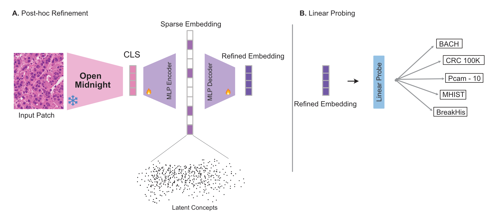

# Post-hoc SAE refinement for OpenMidnight embeddings

We train a sparse autoencoder (SAE) adapter on precomputed OpenMidnight CLS embeddings, then evaluate the refined embedding with linear probing on benchmarks (BACH, PCam-10, BreakHis, CRC-100K, MHIST). 




---


## Installation

We use the same virtual environment as [OpenMidnight](https://github.com/MedARC-AI/OpenMidnight). Run the following commands to install dependencies and setup the environment.

```bash
cd OpenMidnight
./install.sh
source .venv/bin/activate
```

---

## Pipeline

Below we provide the steps needed to replicate our experiments.

All steps use config from `sae_adapter/config_openmidnight.yml`. Adjust data, backbone, model, and training parameters there as needed.

### Step 1: Shard the patch list

Split the full patch list from the txt file (containing the svs filepaths and locations/magnitude of patches used for pretraining) into N shards to extract embeddings in parallel. Run once per shard (for example N=8):

```bash
cd sae_adapter
for i in $(seq 0 7); do python shard_embeddings.py $i 8; done
```

This writes N files such as  - `sample_dataset_30_shard00-of-08.txt` … `shard07-of-08.txt`.

### Step 2: Extract OpenMidnight CLS embeddings

Extract CLS embeddings per shard. Adjust paths in the config and scripts as needed.

**Cluster** (parallel across shards):
```bash
cd sae_adapter
sbatch run_extract_om_embeddings_array.sbatch
```

**Local** (single shard; run once per shard or in parallel manually):
```bash
cd sae_adapter
source ../OpenMidnight/.venv/bin/activate   
SHARD_ID=0 NUM_SHARDS=8 python extract_om_embeddings.py   # change SHARD_ID for each shard
```

### Step 3: Train SAE adapter

Training runs on the sharded `.npy` files (CLS embeddings of OM). Set hyperparams and directory paths in the config file.

**Local:**
```bash
cd sae_adapter
source ../OpenMidnight/.venv/bin/activate
python train_sae_adapter.py
```

**Cluster:** `sbatch run_sae_openmidnight_embeddings.sbatch`


### Step 4: Evaluation (linear probing)

We evaluate on **BACH, PCam-10, BreakHis, CRC-100K**, and **optionally MHIST** using the EVA framework. This repo includes a modified copy of OpenMidnight (under `OpenMidnight/`), along with the SAE backbone wrapper in `OpenMidnight/dinov2/eval/om_sae_backbone.py` and all eva-probe configs set up. From the repo root:

1. **Install eva-probe** (source is in `OpenMidnight/eva-probe/`)
   ```bash
   cd OpenMidnight
   source .venv/bin/activate
   uv pip install -e './eva-probe[vision]' --no-deps
   ```

2. **Set checkpoint paths** in the `eva-probe/run_*.sbatch` files.

3. **Run probing:**
   - **Cluster:** `cd OpenMidnight/eva-probe && sbatch run_bach.sbatch` (or `run_pcam_10.sbatch`, `run_breakhist.sbatch`, `run_crc.sbatch`).

   - **Local:** `cd OpenMidnight/eva-probe && source ../.venv/bin/activate && CUDA_VISIBLE_DEVICES=0 DOWNLOAD_DATA=true eva predict_fit --config ../eval_configs/bach.yaml`. Use a single GPU.

---

## Credits

- **OpenMidnight** ([MedARC-AI/OpenMidnight](https://github.com/MedARC-AI/OpenMidnight)) — a vision foundation model for cpath. This repo includes a modified copy of OpenMidnight under `OpenMidnight/`,
- **EVA** ([kaiko-ai/eva](https://github.com/kaiko-ai/eva)) for linear probing and eval framework.

